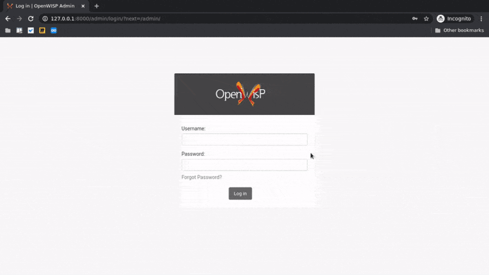
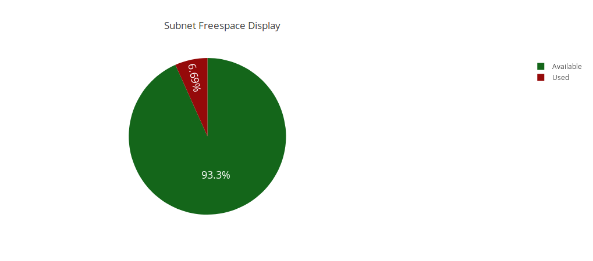
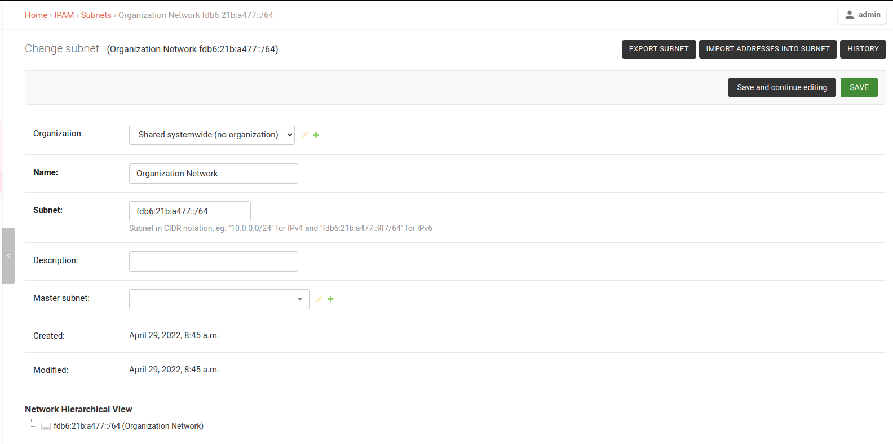
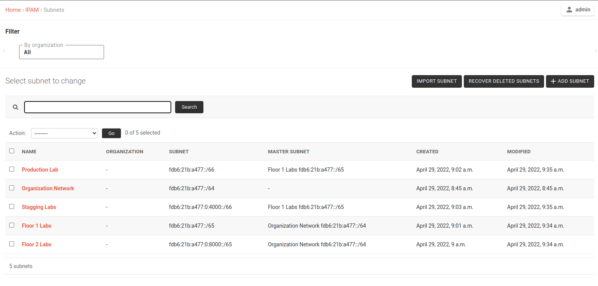

openwisp-ipam
=============

.. image:: https://travis-ci.org/openwisp/openwisp-ipam.svg
  :target: https://travis-ci.org/openwisp/openwisp-ipam

.. image:: https://coveralls.io/repos/openwisp/openwisp-ipam/badge.svg
  :target: https://coveralls.io/r/openwisp/openwisp-ipam

.. image:: https://img.shields.io/pypi/v/openwisp-ipam
  :target: https://pypi.org/project/openwisp-ipam
  :alt: PyPI

.. image:: https://requires.io/github/openwisp/openwisp-ipam/requirements.svg?branch=master
  :target: https://requires.io/github/openwisp/openwisp-ipam/requirements/?branch=master
  :alt: Requirements Status

.. contents:: **Table of Contents**:
   :backlinks: none
   :depth: 2

------------

Available Features
==================

* IPv4 and IPv6 IP address management
* IPv4 and IPv6 Subnet management
* Automatic free space display for all subnets
* Visual display for a specific subnet
* IP request module
* RESTful API to for CRUD operations
* Possibility to search for an IP or subnet
* CSV Import and Export of subnets and their IPs

Dependencies
============

* Python 3.6 or higher
* Django 2.2 or higher

Install development version
===========================

Install tarball:

.. code-block:: shell

    pip install https://github.com/openwisp/openwisp-ipam/tarball/master

Alternatively you can install via pip using git:

.. code-block:: shell

    pip install -e git+git://github.com/openwisp/openwisp-ipam#egg=openwisp-ipam

Installation for development
============================

Install ``openwisp-ipam`` for development using following commands:

.. code-block:: shell

    git clone https://github.com/openwisp/openwisp-ipam.git
    cd openwisp-ipam
    python setup.py develop
    pip install -r requirements-test.txt

Launch the development sever:

.. code-block:: shell

    cd tests/
    ./manage.py migrate
    ./manage.py createsuperuser
    ./manage.py runserver

You can access the admin interface at `http://127.0.0.1:8000/admin/`.

Run Tests
=========

Install test requirements:

.. code-block:: shell

    pip install -r requirements-test.txt

Then run the test suite:

.. code-block:: shell

    ./runtests.py

Visual Display of subnets
=========================

openwisp-ipam provides a graphical representation of a subnet which shows the available free space under any subnet.

RESTful API
===========

API Authentication
##################

The API authentication is based on session based authentication via  REST framework.
This authentication scheme uses Django's default session backend for authentication.

.. code-block:: text

    http -a username:password <HTTP verb> <api url>

Pagination
##########

API pagination is provided with the help `page` parameter.
The default page size is 10 which can be overridden using the `page_size` parameter.

.. code-block:: text

    /api/v1/<api endpoint url>/?page=1&page_size=10

Get First Available IP
######################

A model method to fetch the next available IP address under a specific subnet. This method can also be accessed via a RESTful API.

`openwisp_ipam/base/models.py <openwisp_ipam/base/models.py#L69>`_

GET
+++

Returns the next available IP address under a subnet.

.. code-block:: text

    /api/v1/subnet/<subnet_id>/get-first-available-ip/

Request IP
##########

A model method to create and fetch the next available IP address record under a subnet.

POST
++++

Creates a record for next available IP address and returns JSON data of that record.

.. code-block:: text

    POST /api/v1/subnet/<subnet_id>/request-ip/

===========    ========================================
Param          Description
===========    ========================================
description    Optional description for the IP address
===========    ========================================

Response
++++++++

.. code-block:: json

    {
        "ip_address": "ip_address",
        "subnet": "subnet_uuid",
        "description": "optional description"
    }

IpAddress-Subnet List and Create View
#####################################

An api enpoint to retrieve or create IP addresses under a specific subnet.

GET
+++

Returns the list of IP addresses under a particular subnet.

.. code-block:: text

    /api/v1/subnet/<subnet_id>/ip-address/

POST
++++

Create a new ``IP Address``.

.. code-block:: text

    /api/v1/subnet/<subnet_id>/ip-address/

===========    ========================================
Param          Description
===========    ========================================
ip_address     IPv6/IPv4 address value
subnet         Subnet UUID
description    Optional description for the IP address
===========    ========================================

Subnet List/Create View
#######################

An api endpoint to create or retrieve the list of subnet instances.

GET
+++

Returns the list of ``Subnet`` instances.

.. code-block:: text

    /api/v1/subnet

POST
++++

Create a new ``Subnet``.

.. code-block:: text

    /api/v1/subnet

=============    ========================================
Param            Description
=============    ========================================
subnet           Subnet value in CIDR format
master_subnet    Master Subnet UUID
description      Optional description for the IP address
=============    ========================================

Subnet View
###########

An api endpoint for retrieving, updating or deleting a subnet instance.

GET
+++

Get details of a ``Subnet`` instance

.. code-block:: text

    /api/v1/subnet/<subnet-id>

DELETE
++++++

Delete a ``Subnet`` instance

.. code-block:: text

    /api/v1/subnet/<subnet-id>

PUT
+++

Update details of a ``Subnet`` instance.

.. code-block:: text

    /api/v1/subnet/<subnet-id>

=============    ========================================
Param            Description
=============    ========================================
subnet           Subnet value in CIDR format
master_subnet    Master Subnet UUID
description      Optional description for the IP address
=============    ========================================

IP Address View
###############

An api enpoint for retrieving, updating or deleting a IP address instance.

GET
+++

Get details of an ``IP address`` instance.

.. code-block:: text

    /api/v1/ip-address/<ip_address-id>

DELETE
++++++

Delete an ``IP address`` instance.

.. code-block:: text

    /api/v1/ip-address/<ip_address-id>

PUT
+++

Update details of an ``IP address`` instance.

.. code-block:: text

    /api/v1/ip-address/<ip_address-id>

===========    ========================================
Param          Description
===========    ========================================
ip_address     IPv6/IPv4 value
subnet         Subnet UUID
description    Optional description for the IP address
===========    ========================================

Export Subnet View
##################

View to export subnet data.

POST
++++

.. code-block:: text

    /api/v1/subnet/<subnet-id>/export

Import Subnet View
##################

View to import subnet data.

POST
++++

.. code-block:: text

    /api/v1/import-subnet

Exporting and Importing Subnet
==============================

One can easily import and export `Subnet` data and it's Ip Addresses using `openwisp-ipam`.
This works for both IPv4 and IPv6 types of networks.

Exporting
#########

Data can be exported via the admin interface or by using a management command. The exported data is in `.csv` file format.

From management command
+++++++++++++++++++++++

.. code-block:: shell

    ./manage.py export_subnet <subnet value>

This would export the subnet if it exists on the database.

From admin interface
++++++++++++++++++++

Data can be exported from the admin interface by just clicking on the export button on the subnet's admin change view.

Importing
#########

Data can be imported via the admin interface or by using a management command.
The imported data file can be in `.csv`, `.xls` and `.xlsx` format. While importing
data for ip addresses, the system checks if the subnet specified in the import file exists or not.
If the subnet does not exists it will be created while importing data.

From management command
+++++++++++++++++++++++

.. code-block:: shell

    ./manage.py import_subnet --file=<file path>

From admin interface
++++++++++++++++++++

Data can be imported from the admin interface by just clicking on the import button on the subnet view.

CSV file format
+++++++++++++++

Follow the following structure while creating `csv` file to import data.

.. code-block:: text

    Subnet Name
    Subnet Value

    ip_address,description
    <ip-address>,<optional-description>
    <ip-address>,<optional-description>
    <ip-address>,<optional-description>

------------

Setup (Integrate into other Apps)
=================================

Add ``openwisp_ipam`` to ``INSTALLED_APPS``:

.. code-block:: python

    INSTALLED_APPS = [
        # other apps
        'openwisp_ipam',
    ]

Add the URLs to your main ``urls.py``:

.. code-block:: python

    urlpatterns = [
        # ... other urls in your project ...
        # openwisp-ipam urls
        url(r'^', include('openwisp_ipam.urls')),
    ]

Then run:

.. code-block:: shell

    ./manage.py migrate

Extending openwisp-ipam
=======================

The django app ``tests/openwisp2/sample_ipam/`` adds some changes on
top of the ``openwisp-ipam`` module with the purpose of testing the
module's extensibility. It can be used as an example for extending
``openwisp-ipam`` in your own application. Please note that in this
sample, the name of the project is ``openwisp2`` and the module name
is ``sample_ipam``, you are expected to change these names according to
your project.

*openwisp-ipam* provides a set of models and admin classes which can
be imported, extended and reused by third party apps.

To extend *openwisp-ipam*, **you MUST NOT** add it to ``settings.INSTALLED_APPS``,
but you must create your own app (which goes into ``settings.INSTALLED_APPS``), import the
base classes from *openwisp-ipam* and add your customizations.

In order to help django find the static files and templates of *openwisp-ipam*,
you need to perform the steps described below.

1. Install ``openwisp-ipam``
############################

Install (and add to the requirement of your project) openwisp-ipam::

    pip install openwisp-ipam

2. Add ``EXTENDED_APPS``
########################

Add the following to your ``settings.py``:

.. code-block:: python

    EXTENDED_APPS = ('openwisp_ipam',)

3. Add ``openwisp_utils.staticfiles.DependencyFinder``
######################################################

Add ``openwisp_utils.staticfiles.DependencyFinder`` to
``STATICFILES_FINDERS`` in your ``settings.py``:

.. code-block:: python

    STATICFILES_FINDERS = [
        'django.contrib.staticfiles.finders.FileSystemFinder',
        'django.contrib.staticfiles.finders.AppDirectoriesFinder',
        'openwisp_utils.staticfiles.DependencyFinder',
    ]

4. Add ``openwisp_utils.loaders.DependencyLoader``
##################################################

Add ``openwisp_utils.loaders.DependencyLoader`` to ``TEMPLATES`` in your ``settings.py``:

.. code-block:: python

    TEMPLATES = [
        {
            'BACKEND': 'django.template.backends.django.DjangoTemplates',
            'OPTIONS': {
                'loaders': [
                    'django.template.loaders.filesystem.Loader',
                    'django.template.loaders.app_directories.Loader',
                    'openwisp_utils.loaders.DependencyLoader',
                ],
                'context_processors': [
                    'django.template.context_processors.debug',
                    'django.template.context_processors.request',
                    'django.contrib.auth.context_processors.auth',
                    'django.contrib.messages.context_processors.messages',
                ],
            },
        }
    ]

5. Add swapper configurations
#############################

Add the following to your ``settings.py``:

.. code-block:: python

    # Setting models for swapper module
    OPENWISP_IPAM_IPADDRESS_MODEL = 'YOUR_MODULE_NAME.IpAddress'
    OPENWISP_IPAM_SUBNET_MODEL = 'YOUR_MODULE_NAME.Subnet'

Extending models
################

For the purpose of showing an example, we added a simple "details" field to
the models of openwisp-ipam in the sample app of our test project. Please check the file `here <tests/openwisp2/sample_ipam/models.py>`_.

You can add fields in a similar way in your models.py file.

Extending the admin
###################

You can register your models in admin view.
Please checkout the sample `admin.py <tests/openwisp2/sample_ipam/admin.py>`_.

Extending the ``apps.py``
#########################

Add the following to your module's ``apps.py``:

.. code-block:: python

    from openwisp_ipam.apps import OpenWispIpamConfig

    class SampleIpamConfig(OpenWispIpamConfig):
        name = 'openwisp2.sample_ipam'
        label = 'sample_ipam'

Extending the API Views
#######################

The API view classes can be extended into other django applications as well. Note
that it is not required for extending openwisp-ipam to your app and this section
only needs to be followed if you plan to make changes to the API views.

Create a view file as done in `views.py <tests/openwisp2/sample_ipam/views.py>`_.
Then in the ``urls.py`` to get your modified views and include all other
openwisp-ipam urls, use the following:

``urls.py``:

.. code-block:: python

    from .sample_ipam import views as api_views
    from openwisp_ipam.urls import get_urls

    urlpatterns = [
        # ... other urls in your project ...
        # openwisp-ipam urls
        # url(r'^', include('openwisp_ipam.urls')),
        url(r'^', include(get_urls(api_views)))
    ]

Extending the Tests
###################

Finally, you would want to extend the tests to test ``openwisp-ipam``
as well as your modification, please checkout the `sample tests.py
file <tests/openwisp2/sample_ipam/tests.py>`_.

------------

`Support channels <http://openwisp.org/support.html>`_ |
`Issue Tracker <https://github.com/openwisp/openwisp-ipam/issues>`_ |
`License <https://github.com/openwisp/openwisp-ipam/blob/master/LICENSE>`_

