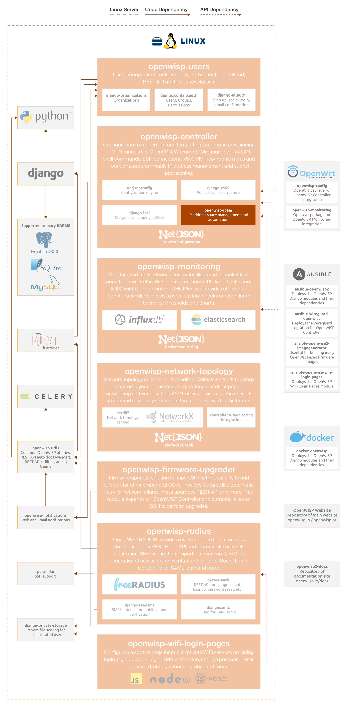

Developer Installation Instructions
===================================

.. include:: ../partials/developer-docs.rst

The following diagram illustrates the role of the IPAM module within the
OpenWISP architecture.

    **OpenWISP Architecture: highlighted IPAM module**

.. important::

    For an enhanced viewing experience, open the image above in a new
    browser tab.

    Refer to :doc:`/general/architecture` for more information.

.. contents:: **Table of contents**:
    :depth: 2
    :local:

Installing for Development
--------------------------

Install sqlite:

.. code-block:: shell

    sudo apt-get install sqlite3 libsqlite3-dev openssl libssl-dev

Fork and clone the forked repository:

.. code-block:: shell

    git clone git://github.com/<your_fork>/openwisp-ipam

Navigate into the cloned repository:

.. code-block:: shell

    cd openwisp-ipam/

Setup and activate a virtual-environment (we'll be using `virtualenv
<https://pypi.org/project/virtualenv/>`_):

.. code-block:: shell

    python -m virtualenv env
    source env/bin/activate

Install development dependencies:

.. code-block:: shell

    pip install -e .
    pip install -r requirements-test.txt

Create database:

.. code-block:: shell

    cd tests/
    ./manage.py migrate
    ./manage.py createsuperuser

Launch development server:

.. code-block:: shell

    ./manage.py runserver

You can access the admin interface at ``http://127.0.0.1:8000/admin/``.

Run tests with (make sure you have the :ref:`selenium dependencies
<selenium_dependencies>` installed locally first):

.. code-block:: shell

    ./runtests

Alternative Sources
-------------------

Pypi
~~~~

To install the latest Pypi:

.. code-block:: shell

    pip install openwisp-ipam

Github
~~~~~~

To install the latest development version tarball via HTTPs:

.. code-block:: shell

    pip install https://github.com/openwisp/openwisp-ipam/tarball/master

Alternatively you can use the git protocol:

.. code-block:: shell

    pip install -e git+git://github.com/openwisp/openwisp-ipam#egg=openwisp_ipam
