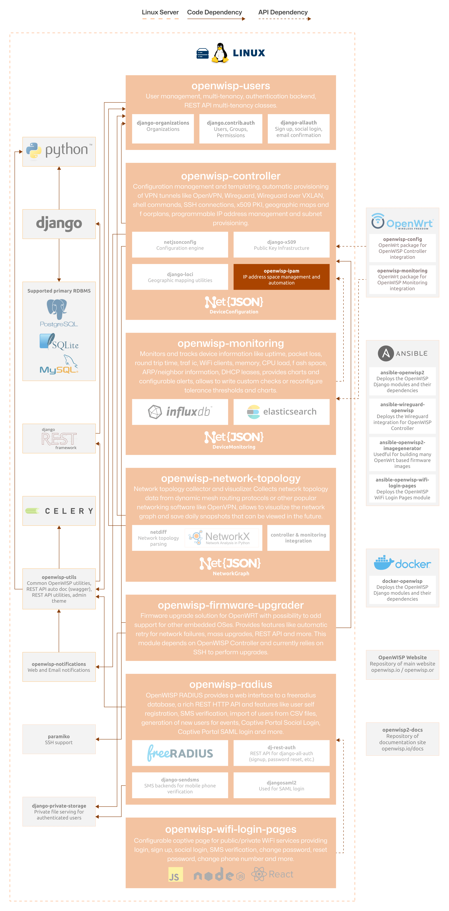

IPAM
====

.. seealso::

    **Source code**: `github.com/openwisp/openwisp-ipam
    <https://github.com/openwisp/openwisp-ipam>`_.

.. image:: https://github.com/openwisp/openwisp-ipam/raw/docs/docs/subnet_demo.gif
    :target: https://github.com/openwisp/openwisp-ipam/raw/docs/docs/subnet_demo.gif
    :alt: Feature Highlights

OpenWISP IPAM provides IP Address Management (IPAM) features, refer to
:doc:`user/intro` for a complete overview. As a core dependency of the
:doc:`OpenWISP Controller </controller/index>`, it facilitates the
automatic provisioning of IP addresses for VPNs such as :doc:`Wireguard
</controller/user/wireguard>` and :doc:`Zerotier
</controller/user/zerotier>`, and allows to implement the :doc:`Subnet
Division Rules feature </controller/user/subnet-division-rules>`.

In addition to its integration with the OpenWISP ecosystem, OpenWISP IPAM
can be used as a standalone Django app: developers proficient in Python
and Django can leverage this module independently to enhance their
projects, for more details on this subject please refer to the
:doc:`developer documentation <developer/index>`.

The following diagram illustrates the role of the IPAM module within the
OpenWISP architecture.

    **OpenWISP Architecture: highlighted IPAM module**

.. important::

    For an enhanced viewing experience, open the image above in a new
    browser tab.

    Refer to :doc:`/general/architecture` for more information.

.. toctree::
    :caption: IPAM Usage Docs
    :maxdepth: 1

    ./user/intro.rst
    ./user/import-export-subnets.rst
    ./user/rest-api.rst

.. toctree::
    :caption: IPAM Developer Docs
    :maxdepth: 2

    Developer Docs Index <developer/index.rst>
